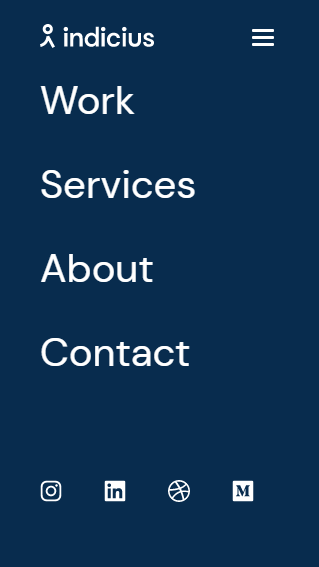
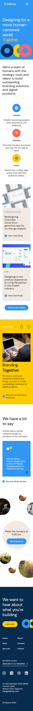
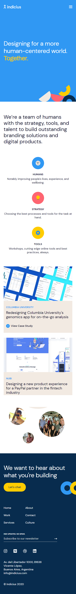
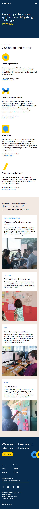
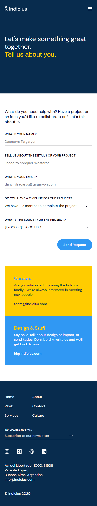
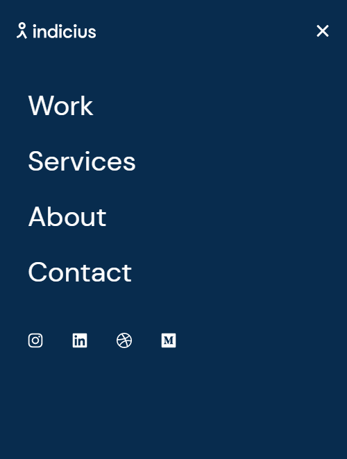
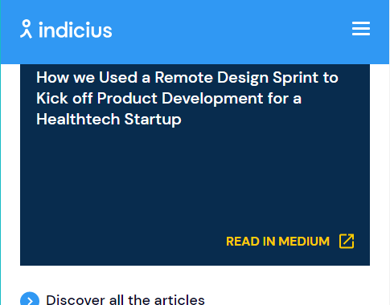
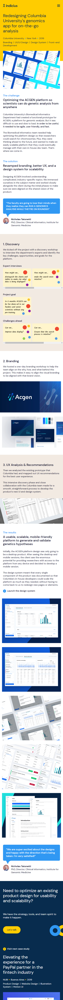
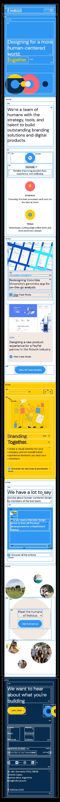

# fluffy-enigma
Frontend Developement Site | Web J2

# Procesverslag
**Auteur:** -jouw naam-

Markdown cheat cheet: [Hulp bij het schrijven van Markdown](https://github.com/adam-p/markdown-here/wiki/Markdown-Cheatsheet). Nb. de standaardstructuur en de spartaanse opmaak zijn helemaal prima. Het gaat om de inhoud van je procesverslag. Besteedt de tijd voor pracht en praal aan je website.

## Bronnenlijst
1. https://projects.verou.me/bubbly/
2. https://indicius.com
3. -...-

## Eindgesprek (week 7/8)

-dit ging goed & dit was lastig-

**Screenshot(s):**

-screenshot(s) van je eindresultaat-

## Voortgang 3 (week 6)

Beide pagina's zijn zo goed als af, nu de grote animaties nog...
Pagina's zijn gecheckt op grote en kleine fouten.

## Voortgang 2 (week 5)

Voortgang met animaties en js, maar loopt nog niet heel lekker.
Menu werkt ook eindelijk!

## Voortgang 1 (week 3)

### Stand van zaken

De eerste pagina is visueel zo goed als klaar, animaties zijn lastig.

*Hoofdpagina*

### Agenda voor meeting

-samen met je groepje opstellen-

### Verslag van meeting

-na afloop snel uitkomsten vastleggen-

## Intake (week 1)

**Je startniveau:** Rood

**Je focus:** Surface

**Je opdracht:** https://www.indicius.com/

**Screenshot(s):**

*Home*

*Services*

*About*

*Contact*

*Menu*

*On ScrollUp*

*Projecten*

**Breakdown-schets(en):**

*About Breakdown*

